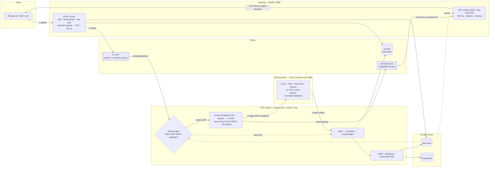

# ocr-serving — one OCR model, four serving stacks

A **streaming OCR service** — upload a PDF, watch text arrive token by token, download JSON,
Markdown or a searchable PDF — built so the GPU half can be swapped between **vLLM**, **Triton**,
**Ray Serve** and **KServe** without touching a line of pipeline code, and measured by one
benchmark harness.

The pipeline is the constant; the serving stack is the variable. That is the experiment.

> Plan and schedule: [PLAN.md](PLAN.md) · Architecture: [docs/architecture.md](docs/architecture.md) ·
> **Testing walkthrough: [docs/testing.md](docs/testing.md)** · Operations runbook: [docs/operations.md](docs/operations.md) ·
> Results: [docs/comparison.md](docs/comparison.md) · Diagrams: [docs/diagrams/](docs/diagrams/)

---

## Run it in two minutes — no GPU, no model download

The repo ships a **CPU mock engine** that speaks the same OpenAI-compatible streaming API as the
four real stacks. Everything except the model is real: the queue, the worker, the streaming, the
artifacts, the dashboards.

```bash
uv sync --extra worker --extra bench --extra dev
cp .env.example .env

docker compose up -d          # redis, postgres, prometheus, grafana
make mock                     # CPU engine        :8001
make gateway                  # API + demo UI     :8080
make worker                   # CPU pipeline      :9101/metrics

open http://localhost:8080    # drag in a PDF and watch it stream
python scripts/smoke.py       # or drive it headlessly, end to end
```

Swap in a real stack by pointing one variable at it — nothing else changes:

```bash
make vllm                                            # RTX 3060, inside WSL2
OCR_ENGINE_BASE_URL=http://localhost:8001/v1 make worker
```

## Real-time inference

<!-- Recorded with `vhs docs/assets/demo.tape` (PLAN.md Week 1 Day 5); once the GIF
     exists, replace this comment with:  -->

Tokens reach the browser while page 40 is still rendering. The stream is a **Redis Stream**, not
pub/sub, which buys three things a naive implementation does not have:

* **resumable** — a dropped connection reconnects with `Last-Event-ID` and continues exactly
  where it stopped; no tokens lost, none repeated;
* **replayable** — a client that connects late still sees the whole run;
* **fan-out** — several viewers (and the WebSocket endpoint) can tail one job independently.

Numbers land in [docs/comparison.md](docs/comparison.md) via `make report` — never hand-typed.

## API

| Method | Path | Purpose |
|---|---|---|
| `POST` | `/v1/ocr` | Upload a PDF/image → `202` + `job_id`. Honours `Idempotency-Key`. |
| `GET` | `/v1/ocr/{id}` | Progress while running, full result when done. |
| `GET` | `/v1/ocr/{id}/stream` | SSE token stream, resumable via `Last-Event-ID`. |
| `WS` | `/v1/ocr/{id}/ws` | The same events over a WebSocket (`?api_key=`). |
| `GET` | `/v1/ocr/{id}/text`, `/markdown`, `/pdf` | Artifacts, including the searchable PDF. |
| `DELETE` | `/v1/ocr/{id}` | Cooperative cancel — the worker stops at the next page. |
| `GET` | `/v1/jobs` | Recent jobs for the caller's tenant (PostgreSQL). |
| `GET` | `/healthz`, `/readyz`, `/metrics` | Liveness, dependency readiness, Prometheus. |

Auth is `X-API-Key` (or `Authorization: Bearer`). Keys map to tenants
(`OCR_API_KEYS=key:tenant`), and tenants scope job visibility, rate limits and page quotas.
Full schema: `http://localhost:8080/docs`.

```bash
curl -X POST localhost:8080/v1/ocr -H 'X-API-Key: dev-key' -F file=@paper.pdf
# {"job_id":"7f3c1a...","status":"queued","stream_url":"/v1/ocr/7f3c1a.../stream", ...}
curl -N localhost:8080/v1/ocr/7f3c1a.../stream -H 'X-API-Key: dev-key'
```

## Architecture



Detailed reference — [`docs/diagrams/architecture.drawio`](docs/diagrams/architecture.drawio), three pages:
system architecture with the numbered request flow, the worker page pipeline, and the job lifecycle with its
failure taxonomy. Narrative walkthrough: [docs/architecture.md](docs/architecture.md).

Per page the worker runs: **classify** (native text layer? blank? duplicate?) → **render** at an
adaptive DPI → **deskew / CLAHE** → **layout** (DocLayout-YOLO ONNX, optional) → **tile** oversized
regions → **stream** each region through the serving stack → **stitch** with overlap dedup →
**normalise** and filter degenerate output.

Three of those steps exist to *avoid* the GPU, which is where the throughput comes from:

| Fast path | When it fires | Cost |
|---|---|---|
| Native text extraction | PDF page already has a text layer | zero GPU tokens, better accuracy |
| Duplicate detection | perceptual hash matches an earlier page | zero GPU tokens, text copied from the original |
| Blank detection | page luminance variance below threshold | zero GPU tokens |

## Reliability

| Property | How |
|---|---|
| At-least-once delivery | Redis Stream consumer group; a job is acked only after its result is durable |
| Crash recovery | `XAUTOCLAIM` reclaims jobs idle past `OCR_VISIBILITY_TIMEOUT_S`; a peer picks them up |
| Poison-job containment | after `OCR_MAX_ATTEMPTS` the job moves to `ocr:jobs:dead` with the reason |
| Permanent vs transient | corrupt/encrypted input fails immediately; engine and I/O errors are retried |
| Partial results | one failed page carries its error; the rest of the document still completes |
| Backpressure | token-bucket rate limit, per-tenant page quota, bounded job/page/region concurrency, engine admission semaphore |
| Graceful shutdown | SIGTERM stops reservations and drains in-flight jobs |
| Idempotency | `Idempotency-Key` returns the original `job_id` instead of duplicating work |
| Degradation | PostgreSQL and the layout model are optional; the service runs and says so in `/readyz` |

## Observability

Every process exports Prometheus metrics (`ocr_` prefix): TTFT and page-latency histograms,
queue depth / pending / dead-lettered, pages by source, engine tokens, retries and in-flight
requests, HTTP latency by route, streaming clients, and rejected-request reasons.

```bash
docker compose up -d                       # Grafana :3000 (admin/admin) — dashboard provisioned
docker compose --profile gpu up -d         # + dcgm-exporter for GPU util / VRAM
```

The **OCR pipeline** dashboard and the alert rules are provisioned from
[`deploy/monitoring/`](deploy/monitoring/) — they live in git, not in Grafana's database. Logs are structured
JSON with `request_id` / `job_id` correlation on every line.

## Benchmarks

One harness, one eval set, one prompt, `temperature=0` — so the comparison measures
orchestration overhead, not a different workload ([protocol](PLAN.md#5-benchmark-protocol)).

```bash
make corpus                                             # 1k pages, manifest pins the eval subset
make bench LABEL=vllm BASE_URL=http://localhost:8001/v1
make coldstart LABEL=vllm BASE_URL=http://localhost:8001/v1
make report                                             # -> docs/comparison.md
```

Reported per concurrency level {1, 4, 8, 16}: TTFT p50/p95/p99, e2e p50/p95/p99, per-request and
aggregate tokens/s, pages/min, and classified error counts. Cold start is reported twice —
process/engine and Kubernetes pod — because they answer different questions.

## Configuration

Everything is `OCR_`-prefixed env, validated at startup, documented in
[`.env.example`](.env.example) with defaults in [`src/ocr_serving/common/config.py`](common/config.py). The knobs
that matter most: `OCR_ENGINE_BASE_URL` (which stack), `OCR_WORKER_CONCURRENCY` /
`OCR_PAGE_CONCURRENCY` (parallelism), `OCR_NATIVE_TEXT_EXTRACTION` (GPU bypass),
`OCR_RATE_LIMIT_RPS` and `OCR_QUOTA_PAGES_PER_DAY` (backpressure).

## Tests

```bash
make test        # 149 tests, ~90 s, no GPU / Redis / model required
make lint        # 160 with a PostgreSQL server; see docs/testing.md
```

`fakeredis` backs the queue and event streams; the mock engine is mounted in-process over an ASGI
transport. The suite covers the real code paths — auth, quotas, streaming and SSE resume, queue
reclaim and dead-lettering, the page pipeline end to end, artifact generation, cancellation and
partial failure — not just imports. CI additionally builds both images and runs the end-to-end
smoke against a real Redis.

## Repo layout

```
src/ocr_serving/          the installable package
  common/                 config · schemas · logging · metrics · Redis client · queue ·
                          events · engine client · storage · rate limits · PostgreSQL store
  gateway/                FastAPI app, auth, middleware, demo UI
  workers/                CPU pipeline: intake · preprocess · layout · postprocess ·
                          searchable PDF · worker loop
  serving/mock/           CPU engine stand-in — why this repo runs without a GPU
  serving/ray/            Ray Serve app + Ray Data batch job
  serving/bentoml/        optional wrap

deploy/                   everything ops-facing, nothing importable
  docker/                 multi-stage Dockerfile (gateway · worker · mock)
  monitoring/             Prometheus config, alert rules, provisioned Grafana dashboard
  vllm/ triton/ ray/      launch scripts, model repository, Serve config
  kserve/                 k3s GPU setup, InferenceService, HPA, canary manifest
  cloudflared/            public demo tunnel notes

benchmarks/               harness · corpus builder · cold start · report generator
scripts/                  end-to-end smoke client
tests/                    160 tests — no GPU, Redis or model required
docs/                     architecture · operations runbook · comparison · blog outline
  diagrams/               architecture.drawio (3 pages), mermaid overview, design sketches
```

## Status

Weeks 2–4 of [PLAN.md](PLAN.md) — the Ray Serve, KServe and Triton runs and their numbers — are
the remaining work; their configs are in `serving/` and the harness is stack-agnostic. The
pipeline, streaming, reliability, observability and benchmark tooling described above are built
and tested.
